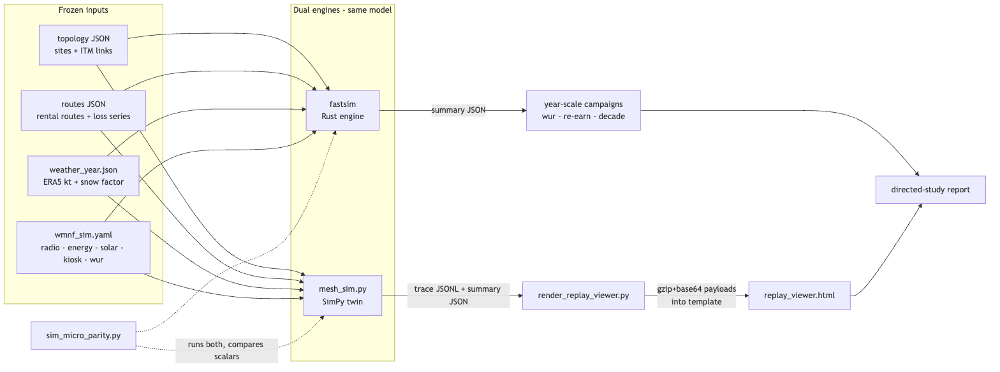
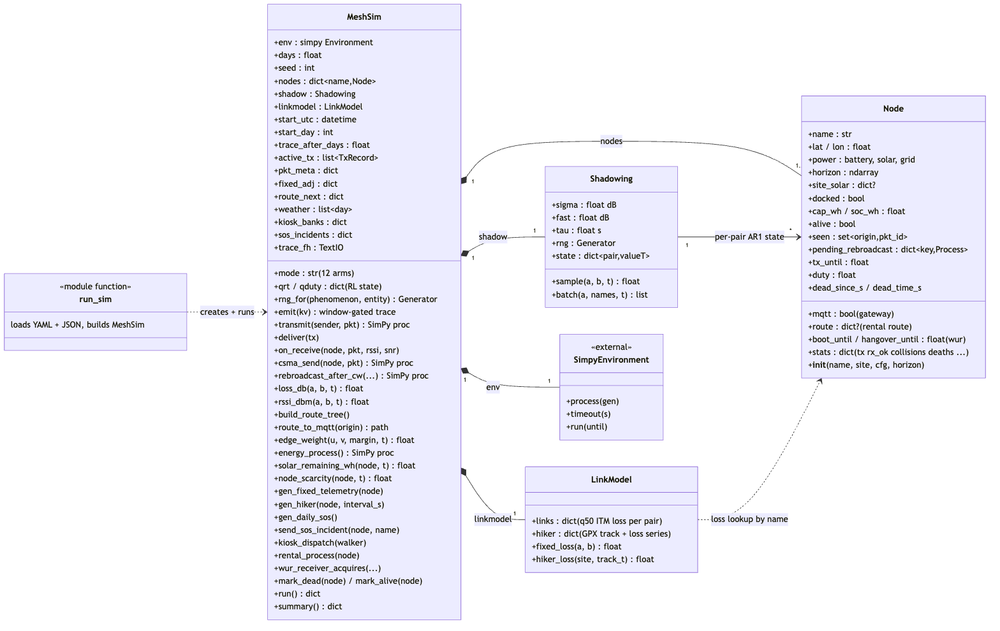
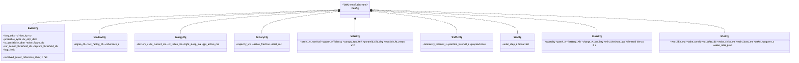
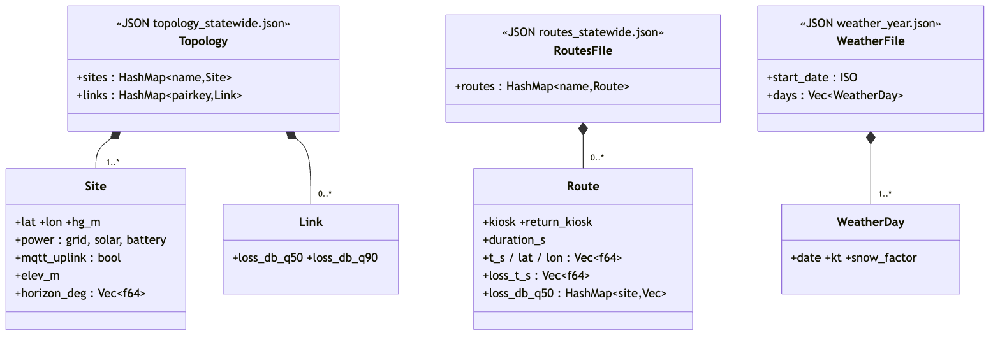
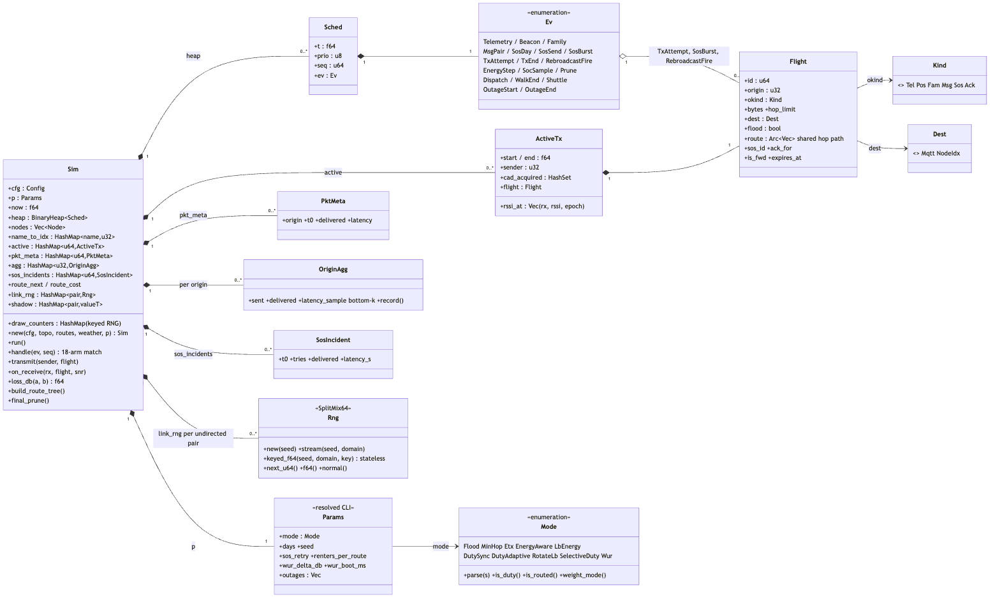
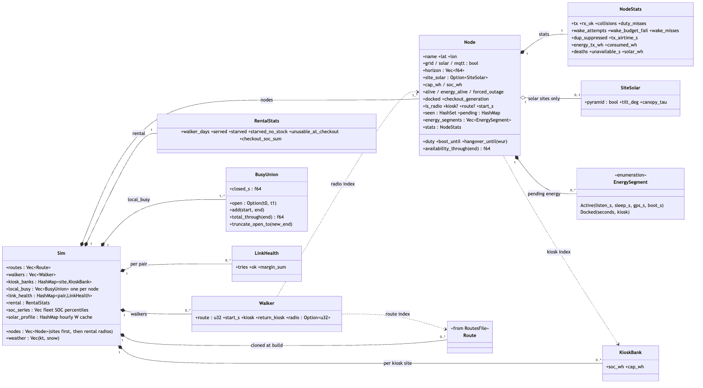
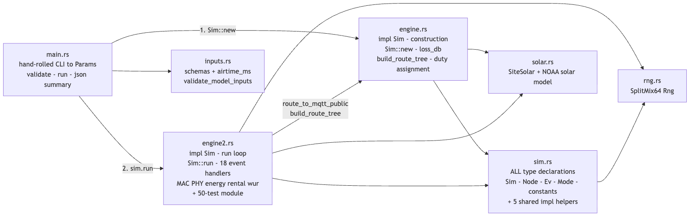
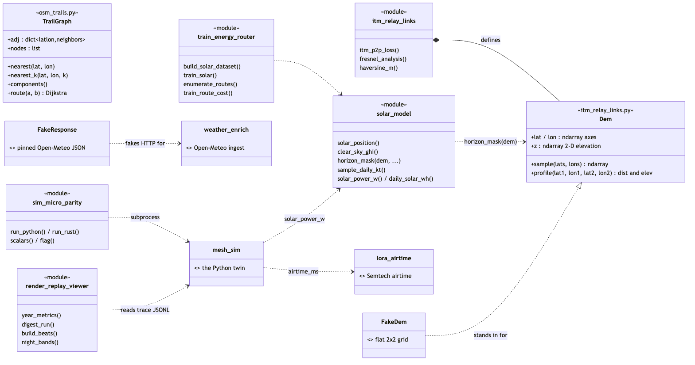

# Resilient Emergency MANETs for Wilderness Safety

Main research/orchestration repo for Summer 2026 directed study:
- planning + methodology
- data acquisition schema + QA
- AIRMap calibration + validation
- analysis outputs and final report artifacts

Current evidence status: this is a research prototype, not a field-validated or
legally cleared emergency network. Start with the dated
[audit and correction ledger](docs/audit-correction-ledger-2026-07-13.md) before
citing any generated result.

## Architecture — class diagrams

Structural map of the codebase (as of 2026-08-04). Mermaid sources live next to
the PNGs in [`docs/diagrams/`](docs/diagrams/); regenerate with
`npx @mermaid-js/mermaid-cli -i <file>.mmd -o <file>.png -b white -s 2`.

### System overview

Four frozen inputs feed two peer engines implementing the same model: the Rust
`fastsim` runs the canonical year-scale campaigns, the Python SimPy twin
generates the packet traces behind the replay viewer, and
`sim_micro_parity.py` runs both on identical arguments to compare summary
scalars.

### Python twin — `scripts/mesh_sim.py`

Four classes. `Node` is pure state (its only method is `__init__`); all
behavior — PHY, MAC, routing, energy, traffic, wake-up radio, lifecycle — lives
on `MeshSim`, driven by a `simpy.Environment` of generator processes. The 12
policy arms (including the RL modes `q_routing`/`rl_duty`, which exist only in
this engine) are branch selections inside `MeshSim` methods, not subclasses.

### Rust fastsim — config and input schemas (`inputs.rs`)

Only `Deserialize` is ever derived in the crate; the output summary JSON is
hand-built in `main.rs`. A fail-closed `validate_model_inputs()` checks all
four inputs before the engine is constructed.

### Rust fastsim — runtime core: events and packets

`Sim` is the deliberate god object mirroring `MeshSim`. Scheduling is a
`BinaryHeap` of `Sched` entries (ordered time → priority → sequence) carrying
one of 18 `Ev` variants, dispatched by a single 18-arm `handle()` match.
Packets travel as `Flight` values, in the air as `ActiveTx`. RNG is two-tier:
stateless keyed draws (14 domain tags + per-entity counters) plus stateful
per-link streams for shadowing.

### Rust fastsim — population, energy, and rental

Dashed arrows are `u32` index references into `Sim::nodes` / `Sim::routes` —
the crate's convention instead of ownership; `name_to_idx` is the only
name→index bridge. Energy is banked lazily as `EnergySegment`s and settled in
batch.

### Rust source layout — one class, three files

`engine.rs` and `engine2.rs` are **not** two engines: they are two halves of
one `impl Sim` (construction vs. run loop), split by file size and always
modified together. Every mode runs the identical pair; `Mode` only selects
behavior branches inside it.

### Supporting tooling and test doubles

Outside the engines the only real classes are `Dem` (DEM raster → ITM terrain
profiles) and `TrailGraph` (OSM trail routing); the rest of the toolchain is
functional modules.

